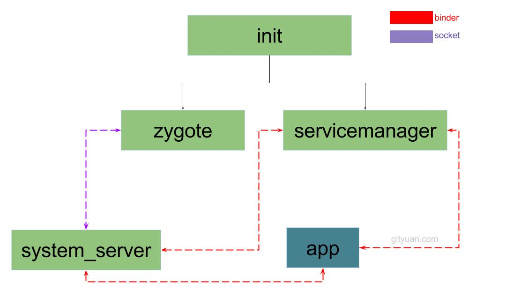

# Android启动详解(一)_系统服务的启动

## 概述

Android 基于 Linux 操作系统，我们所有的 App 都运行于一个 Linux 操作系统中，当我们日常写各种应用层代码时，有时候会出现各种底层问题，如果不知原理，很有可能解决起来相当费劲，这篇文章将大致描述 Android 在 Linux 系统中都做了什么，为什么我们 App 只要写 Activity 就可以启动一个应用，App 的入口在哪里，Launcher 是啥，应用间如何通信的等等问题去追踪。。。

## JVM 简述

我们常写 App 应用层代码，都会知道一点，Android app 运行于 Dalvik 虚拟机或 ART 虚拟机,对虚拟机不太了解的童鞋会不太清楚虚拟机在这起到了什么作用，这里做一个简述。

Java 是跨平台的高级语言，系统不一样，自然各个操作系统的具体底层操作规则不一致，Java 如何做到跨平台的？就是靠 JVM , JVM 实际上是个协议规范，它定义了 Java 可操作的内存模型，程序执行指令等让上层代码和操作系统有了一个中间层负责调度，可以让上层无需知道底层具体是什么平台，只要有支持该平台的虚拟机，那就可以运行。

在 JVM 中，**每启动一个 JVM 进程就代表启动了一个可独立运行的 App** , 每个进程内拥有独立的内存空间，JVM拥有自己的内存模型去管理进程内的内存空间，这部分属于虚拟机所规定的 JVM 运行时数据区和 JVM 执行引擎，由 JVM 为每个 App 去自动分配可用内存和管理内存，保证了安全性。

Android 是运行于 Dalvik 虚拟机 和 ART 虚拟机，它们在绝大部分的实现上都遵循了 JVM 规范，由此可见，Android 每启动一个 App 都是启动了一个虚拟机进程来独立运行该 App 的可执行代码和内存管理空间。

## init

当 Linux Kernel 启动后将启动一个 init 进程执行 /system/core/init/Init.cpp 中的 main 方法, init 进程中读取了 init.rc 文件去启动了 Zygote 进程和 ServiceManager 进程

Zygote 进程负责启动配置所有 Android App子进程和服务进程, ServiceManager 负责了服务的管理，和各子进程间的通信管理，其为 Binder 服务管家




## Zygote

Zygote，英语中翻译过来叫“受精卵”，它是 Linux 系统最先 fork 出来的进程，什么叫 fork ,实际上就是一个 fork 函数复制了一个进程。Android 是基于 Linux 系统，所以 Android 的启动必定就是启动了个 Linux 系统，一个系统必须有个进程开跑才能运行，这个进程叫 init 进程，可以说所有的 Linux 进程都是 init 进程通过调用 fork 创建出来的，zygote 进程同样也是。

通过 JVM 简述中可知，每个 Android App 都是一个独立的虚拟机进程来执行的，这个虚拟机进程也就是通过 zygote 进程 fork 出来的，也就是所有 Android App 进程都是 zygote 进程的子进程，zygote “受精卵” 这个单词很好的表达了该进程的意思。

写过 Java 程序都知道，所有的 Java 程序的起始入口都在 Main 方法，那启动了 Zygote 进程的 main 方法在哪呢？答案是 ZygoteInit.java 类中的 main 方法。ZygoteInit 类是 Android 第一次进入到 Java 的世界中，让我们来看看 ZygoteInit 的 main 方法：

```java
public class ZygoteInit {
    public static void main(String argv[]) {
        // ...
        // 省略某些代码
        try {

            boolean startSystemServer = false;
            String socketName = "zygote";
            String abiList = null;
            for (int i = 1; i < argv.length; i++) {
                if ("start-system-server".equals(argv[i])) {
                    startSystemServer = true;
                } else if (argv[i].startsWith(ABI_LIST_ARG)) {
                    abiList = argv[i].substring(ABI_LIST_ARG.length());
                } else if (argv[i].startsWith(SOCKET_NAME_ARG)) {
                    socketName = argv[i].substring(SOCKET_NAME_ARG.length());
                } else {
                    throw new RuntimeException("Unknown command line argument: " + argv[i]);
                }
            }

            if (abiList == null) {
                throw new RuntimeException("No ABI list supplied.");
            }

            // 启动一个 ZygoteSocket 服务
            registerZygoteSocket(socketName);

            // ...
            // 省略某些代码

            if (startSystemServer) {
                // 启动 SystemServer
                startSystemServer(abiList, socketName);
            }

            // 创建一个死循环让前面启动的 ZygoteSocket 能一直接收通信消息
            runSelectLoop(abiList);

        } catch (MethodAndArgsCaller caller) {
            caller.run();
        } catch (Throwable ex) {
            Log.e(TAG, "Zygote died with exception", ex);
            closeServerSocket();
            throw ex;
        }
    }
}
```

由上面代码可见，ZygoteInit  的 main 方法主要做了三件事：
* 启动了一个名叫 Zygote 的 Socket 服务
* 启动了一个 SystemServer
* 开启一个死循环让 Zygote Socket 一直接收消息

这个启动的 Zygote Socket 实际上是系统内部服务做进程间通信的一个 ServerSocket ，关于它后面再说。可以看到， Zygote 启动了一个 SystemServer 来看看启动代码

```java
     /**
     * 准备参数并 fork 一个 system server 进程
     * Prepare the arguments and fork for the system server process.
     */
    private static boolean startSystemServer(String abiList, String socketName)
            throws MethodAndArgsCaller, RuntimeException {
        // ... 省略部分代码
        /* Hardcoded command line to start the system server */
        String args[] = {
            "--setuid=1000",
            "--setgid=1000",
            "--setgroups=1001,1002,1003,1004,1005,1006,1007,1008,1009,1010,1018,1021,1032,3001,3002,3003,3006,3007,3009,3010",
            "--capabilities=" + capabilities + "," + capabilities,
            "--nice-name=system_server",
            "--runtime-args",
            "com.android.server.SystemServer", // 指定了类参数为 SystemServer 其最后会是 RuntimeInit.applicationInit 中的 startClass 参数
        };
        ZygoteConnection.Arguments parsedArgs = null;

        int pid;

        try {
            // 创建参数
            parsedArgs = new ZygoteConnection.Arguments(args);
            ZygoteConnection.applyDebuggerSystemProperty(parsedArgs);
            ZygoteConnection.applyInvokeWithSystemProperty(parsedArgs);

            /* Request to fork the system server process */
            // fork 一个 SystemServer 进程并返回进程的 pid
            pid = Zygote.forkSystemServer(
                    parsedArgs.uid, parsedArgs.gid,
                    parsedArgs.gids,
                    parsedArgs.debugFlags,
                    null,
                    parsedArgs.permittedCapabilities,
                    parsedArgs.effectiveCapabilities);
        } catch (IllegalArgumentException ex) {
            throw new RuntimeException(ex);
        }

        /* For child process */
        if (pid == 0) {
            // 由于克隆的进程也同时执行到该代码，如果 pid 为 0 则当前进程为子进程
            if (hasSecondZygote(abiList)) {
                waitForSecondaryZygote(socketName);
            }

            // 进一步处理 SytemServer 这个子进程
            handleSystemServerProcess(parsedArgs);
        }

        return true;
    }
```

由代码注释可见，startSystemServer 做的就是 fork 一个 system server 的进程, 最终的 Zygote.forkSystemServer 会调用 native 方法去 fork 这个进程，这个 system server 进程就是系统服务进程，所有的系统服务都和它有关。

## SystemServer

SystemServer 是 Android 中一个极重要的进程，为什么说极重要，因为我们日常 App 开发通过 Context.getSystemServer 方法获得的系统服务都是有他来创建管理的，比如 ActivityManagerService, PackageManagerService, WindowManagerService...。咱们接着看上面 startSystemServer 中所调用的 handleSystemServerProcess 方法,并将包装的参数传递过去，该参数中包含了 com.android.server.SystemServer 这个类地址:

```java
    private static void handleSystemServerProcess(
            ZygoteConnection.Arguments parsedArgs)
            throws ZygoteInit.MethodAndArgsCaller {
        // 由于在克隆子进程前启动了一个 ServerSocket 但是 SystemServer 并不需要这个 Socket 连接，所以先关闭该 Socket
        closeServerSocket();

        // set umask to 0077 so new files and directories will default to owner-only permissions.
        Os.umask(S_IRWXG | S_IRWXO);

        if (parsedArgs.niceName != null) {
            Process.setArgV0(parsedArgs.niceName);
        }

        final String systemServerClasspath = Os.getenv("SYSTEMSERVERCLASSPATH");
        if (systemServerClasspath != null) {
            performSystemServerDexOpt(systemServerClasspath);
        }

        if (parsedArgs.invokeWith != null) {
            // 省略部分代码
        } else {
            ClassLoader cl = null;
            if (systemServerClasspath != null) {
                // 给当前线程设置类加载器 PathClassLoader
                cl = createSystemServerClassLoader(systemServerClasspath,
                                                   parsedArgs.targetSdkVersion);
                Thread.currentThread().setContextClassLoader(cl);
            }
            // 对 SystemServer 进程进行初始化 并执行 SytemServer 类的 main 方法
            RuntimeInit.zygoteInit(parsedArgs.targetSdkVersion, parsedArgs.remainingArgs, cl);
        }
    }
```

可见 handleSystemServerProcess 方法就是对 SystemServer 进程做初始化操作，先是关闭了 zygote 进程中开启的 ServerSocket 然后找到要该进程最早执行的 main 方法的 SystemServer 类,并设置了当前的类加载器，最后跑到了 RuntimeInit 方法再进一步初始化进程相关，接着看看  RuntimeInit.zygoteInit 方法:

```java
    public class RuntimeInit {
        public static final void zygoteInit(int targetSdkVersion, String[] argv, ClassLoader classLoader)
            throws ZygoteInit.MethodAndArgsCaller {
                // ...省略部分代码
                commonInit();
                nativeZygoteInit();
                applicationInit(targetSdkVersion, argv, classLoader);
        }

        private static final void commonInit() {
            // 设置默认的未捕捉异常处理
            Thread.setDefaultUncaughtExceptionHandler(new UncaughtHandler());

            // 设置时区
            TimezoneGetter.setInstance(new TimezoneGetter() {
                @Override
                public String getId() {
                    return SystemProperties.get("persist.sys.timezone");
                }
            });
            TimeZone.setDefault(null);

            // 重置 Log
            LogManager.getLogManager().reset();
            new AndroidConfig();

            // 设置默认 Http UserAgent
            String userAgent = getDefaultUserAgent();
            System.setProperty("http.agent", userAgent);

            // 设置socket的tag，做网络流量统计
            NetworkManagementSocketTagger.install();

            // ...省略部分代码
        }

        private static void applicationInit(int targetSdkVersion, String[] argv, ClassLoader classLoader)
            throws ZygoteInit.MethodAndArgsCaller {
            // 设置为 true 代表应用程序退出时将不会不调用AppRuntime.onExit()，否则会在退出前调用该方法
            nativeSetExitWithoutCleanup(true);

            // 设置虚拟机的内存利用率参数值为0.75
            VMRuntime.getRuntime().setTargetHeapUtilization(0.75f);
            VMRuntime.getRuntime().setTargetSdkVersion(targetSdkVersion);

            final Arguments args;
            try {
                args = new Arguments(argv);
            } catch (IllegalArgumentException ex) {
                Slog.e(TAG, ex.getMessage());
                // let the process exit
                return;
            }

            // The end of of the RuntimeInit event (see #zygoteInit).
            Trace.traceEnd(Trace.TRACE_TAG_ACTIVITY_MANAGER);

            // 反射调用 startClass 的静态 main 方法 , 由 ZygoteInit.startSystemServer 方法可见 startClass 就是 SystemServer 类
            invokeStaticMain(args.startClass, args.startArgs, classLoader);
        }
    }
```

以上代码可见 zygoteInit 方法初始化了当前进程的默认异常捕捉处理，时区，Log 等配置，然后配置虚拟机后反射执行了传递来的类的静态 main 方法，由前文可见该类是 SytemServer 类，到这里算正是完成 SystemServer 进程的创建和初始化了，该流程图示:


然后看 SystemServer 类的 main 方法:

```java
    public final class SystemServer {
        /**
        * The main entry point from zygote.
        */
        public static void main(String[] args) {
            new SystemServer().run();
        }

        private void run() {
            try {
                // ... 省略部分代码

                // Prepare the main looper thread (this thread).
                android.os.Process.setThreadPriority(
                    android.os.Process.THREAD_PRIORITY_FOREGROUND);
                android.os.Process.setCanSelfBackground(false);

                // 准备主线程的 Looper
                Looper.prepareMainLooper();

                // Initialize native services.
                // 加载本地系统服务
                System.loadLibrary("android_servers");

                // Initialize the system context.
                // 初始化系统上下文
                createSystemContext();

                // Create the system service manager.
                // 创建 SystemServiceManager
                mSystemServiceManager = new SystemServiceManager(mSystemContext);
                LocalServices.addService(SystemServiceManager.class, mSystemServiceManager);
            } finally {
                Trace.traceEnd(Trace.TRACE_TAG_SYSTEM_SERVER);
            }

            // Start services.
            // 启动所有服务
            try {
                Trace.traceBegin(Trace.TRACE_TAG_SYSTEM_SERVER, "StartServices");
                startBootstrapServices();
                startCoreServices();
                startOtherServices();
            } catch (Throwable ex) {
                Slog.e("System", "******************************************");
                Slog.e("System", "************ Failure starting system services", ex);
                throw ex;
            } finally {
                Trace.traceEnd(Trace.TRACE_TAG_SYSTEM_SERVER);
            }

            // For debug builds, log event loop stalls to dropbox for analysis.
            if (StrictMode.conditionallyEnableDebugLogging()) {
                Slog.i(TAG, "Enabled StrictMode for system server main thread.");
            }

            // 启动主线程 Looper 循环
            Looper.loop();
            throw new RuntimeException("Main thread loop unexpectedly exited");
        }
    }
```

以上代码可见， SystemServer 的 main 方法创建了一个自己的实例，然后调用了 run 方法执行具体事情。通过注释可以看到，run 方法中，其创建了一个 SystemContext 系统上下文，创建了 SystemServiceManager 管理类，最后启动了所有系统服务。

看到 Context 这个单词，那肯定是我们最熟悉的，先来看 createSystemContext 方法:

```java
    private void createSystemContext() {
        ActivityThread activityThread = ActivityThread.systemMain();
        mSystemContext = activityThread.getSystemContext();
        mSystemContext.setTheme(DEFAULT_SYSTEM_THEME);
    }
```

createSystemContext 方法通过 ActivityThread 的静态方法 systemMain 拿到了一个 ActivityThread 对象，然后调用了该对象的 getSystemContext 获取了一个 Context 对象然后设置了默认的系统主题样式。ActivityThread 类，我们后续将详细描述，先看这里做调用的方法里都做了什么。

```java
    public final class ActivityThread {

        Application mInitialApplication;

        public static ActivityThread systemMain() {
            // ...省略代码
            ActivityThread thread = new ActivityThread();
            thread.attach(true);
            return thread;
        }

        public ContextImpl getSystemContext() {
            synchronized (this) {
                if (mSystemContext == null) {
                    mSystemContext = ContextImpl.createSystemContext(this);
                }
                return mSystemContext;
            }
        }

        private void attach(boolean system) {
            sCurrentActivityThread = this;
            mSystemThread = system;
            if (!system) {
                // ...省略代码
            } else {
                // Don't set application object here -- if the system crashes,
                // we can't display an alert, we just want to die die die.
                android.ddm.DdmHandleAppName.setAppName("system_process",
                        UserHandle.myUserId());
                try {
                    mInstrumentation = new Instrumentation();
                    ContextImpl context = ContextImpl.createAppContext(
                            this, getSystemContext().mPackageInfo);
                    mInitialApplication = context.mPackageInfo.makeApplication(true, null);
                    mInitialApplication.onCreate();
                } catch (Exception e) {
                    throw new RuntimeException(
                            "Unable to instantiate Application():" + e.toString(), e);
                }
            }

            // ...省略代码
        }
    }
```

```java
    class ContextImpl extends Context {

        /**
         * 创建一个系统Context
         */
        static ContextImpl createSystemContext(ActivityThread mainThread) {
            LoadedApk packageInfo = new LoadedApk(mainThread);
            ContextImpl context = new ContextImpl(null, mainThread,
                packageInfo, null, null, 0, null, null, Display.INVALID_DISPLAY);
            context.mResources.updateConfiguration(context.mResourcesManager.getConfiguration(),
                context.mResourcesManager.getDisplayMetrics());
            return context;
        }

        /**
         * 创建一个 App 的 Context
         */
        static ContextImpl createAppContext(ActivityThread mainThread, LoadedApk packageInfo) {
            if (packageInfo == null) throw new IllegalArgumentException("packageInfo");
            return new ContextImpl(null, mainThread,
                    packageInfo, null, null, 0, null, null, Display.INVALID_DISPLAY);
        }
    }
```

由代码可见，静态方法 systemMain 创建了一个 ActivityThread 对象，调用其 attach 方法（注意这里传参为 true），然后返回了这个 ActivityThread 对象。attach 方法中将当前 ActivityThread 对象赋值给了一个类静态变量 sCurrentActivityThread , 而且将 mSystemThread 变量赋值为 true,然后创建了个 ContextImpl 的 App Context 实现类对象，然后通过这个 Context 创建了一个 Application 对象并调用了 onCreate 方法。getSystemContext 方法是返回一个单例的 ContextImpl 对象,在调用 attach 中创建 app context 实现类对象时传参的 LoadedApk 对象是通过 getSystemContext 对象中获取的，所以可见，系统的 LoadedApk 对象实际和 App 的 LoadedApk 对象是同一个对象，LoadedApk 这个类的作用就顾名思义了。

回到 SystemServer， SystemServer 在 createSystemContext 调用后就将该 systemContext 保存为类的属性然后 new 了一个 SystemServiceManager 对象并将该 systemContext 传递了给它。然后依次调用了 startBootstrapServices ， startCoreServices()，
startOtherServices() 三个方法去启动系统的服务，接着看看这三个方法的实现,首先看 startBootstrapServices:

```java
    private void startBootstrapServices() {
        Installer installer = mSystemServiceManager.startService(Installer.class);

        // 启动 ActivityManagerService 服务
        mActivityManagerService = mSystemServiceManager.startService(
                ActivityManagerService.Lifecycle.class).getService();
        mActivityManagerService.setSystemServiceManager(mSystemServiceManager);
        mActivityManagerService.setInstaller(installer);

        // 启动电源管理服务
        mPowerManagerService = mSystemServiceManager.startService(PowerManagerService.class);

        // 将电源管理服务交给 ActivityManagerService 管理
        mActivityManagerService.initPowerManagement();

         // 启动显示管理服务
        mDisplayManagerService = mSystemServiceManager.startService(DisplayManagerService.class);

        // 指定服务启动到了 PHASE_WAIT_FOR_DEFAULT_DISPLAY 阶段
        mSystemServiceManager.startBootPhase(SystemService.PHASE_WAIT_FOR_DEFAULT_DISPLAY);

        // 启动包管理服务
        traceBeginAndSlog("StartPackageManagerService");
        mPackageManagerService = PackageManagerService.main(mSystemContext, installer,
                mFactoryTestMode != FactoryTest.FACTORY_TEST_OFF, mOnlyCore);
        mFirstBoot = mPackageManagerService.isFirstBoot();
        mPackageManager = mSystemContext.getPackageManager();

        // 启动用户管理服务
        mSystemServiceManager.startService(UserManagerService.LifeCycle.class);
        Trace.traceEnd(Trace.TRACE_TAG_SYSTEM_SERVER);

        // 将 ActivityManager 加入到 ServiceManager 中并加入几个自己管理的服务
        mActivityManagerService.setSystemProcess();

        // 启动传感器服务
        startSensorService();
    }
```

startBootstrapServices 主要启动了 AMS，PMS，DMS 几个系统服务, SystemServiceManager.startService 方法实际就是反射实例化了具体服务对象，并加入到自己管理的服务列表中，然后调用了这些服务的 onStart 方法。SystemServiceManager.startBootPhase 是告诉所有服务当前服务启动到了哪个阶段。

```java
    private void startCoreServices() {
        // 启动服务BatteryService，用于统计电池电量，需要LightService.
        mSystemServiceManager.startService(BatteryService.class);

        // 启动服务 UsageStatsService，用于统计应用使用情况
        mSystemServiceManager.startService(UsageStatsService.class);
        mActivityManagerService.setUsageStatsManager(
                LocalServices.getService(UsageStatsManagerInternal.class));

        // 启动 WebViewUpdateService 服务
        mWebViewUpdateService = mSystemServiceManager.startService(WebViewUpdateService.class);
    }
```

startCoreServices 启动服务 BatteryService，UsageStatsService，WebViewUpdateService。

```java
    private void startOtherServices() {
        // ...省略代码

        mSystemServiceManager.startBootPhase(SystemService.PHASE_LOCK_SETTINGS_READY);
        mSystemServiceManager.startBootPhase(SystemService.PHASE_SYSTEM_SERVICES_READY);
        // ...
        // 准备好window, power, package, display服务
        wm.systemReady();
        mPowerManagerService.systemReady(...);
        mPackageManagerService.systemReady();
        mDisplayManagerService.systemReady(...);
        mActivityManagerService.systemReady(new Runnable() {
            public void run() {
                mSystemServiceManager.startBootPhase(
                     SystemService.PHASE_ACTIVITY_MANAGER_READY);
                // ...省略代码
                mSystemServiceManager.startBootPhase(
                     SystemService.PHASE_THIRD_PARTY_APPS_CAN_START);
            }
        });
    }
```

startOtherServices 方法代码相当长，这里省略了大多代码，这里启动了其他所需的各个系统服务，最后都调用了 SystemService 的 systemReady 方法告诉各服务系统服务已经准备好。

由上面代码可见，在服务启动阶段，SystemServiceManager.startBootPhase 方法一直在被调用，该方法传参为服务的各个阶段的标志位，整体启动标志流程如下图所示


该流程的调用代码位置大致为：

```java
    public final class SystemServer {

        private void startBootstrapServices() {
            ...
            //phase100
            mSystemServiceManager.startBootPhase(SystemService.PHASE_WAIT_FOR_DEFAULT_DISPLAY);
            ...
        }

        private void startCoreServices() {
            ...
        }

        private void startOtherServices() {
            ...
            //phase480 && 500
            mSystemServiceManager.startBootPhase(SystemService.PHASE_LOCK_SETTINGS_READY);
            mSystemServiceManager.startBootPhase(SystemService.PHASE_SYSTEM_SERVICES_READY);

            ...
            mActivityManagerService.systemReady(new Runnable() {
                public void run() {
                    //phase550
                    mSystemServiceManager.startBootPhase(
                            SystemService.PHASE_ACTIVITY_MANAGER_READY);
                    ...
                    //phase600
                    mSystemServiceManager.startBootPhase(
                            SystemService.PHASE_THIRD_PARTY_APPS_CAN_START);
                }
            }
        }
    }

    public final class ActivityManagerService extends ActivityManagerNative
        implements Watchdog.Monitor, BatteryStatsImpl.BatteryCallback {

        final void finishBooting() {
            //phase1000
            mSystemServiceManager.startBootPhase(SystemService.PHASE_BOOT_COMPLETED);
        }
    }

```

当 phase 为 PHASE_BOOT_COMPLETED 时，代表系统服务和 Home 应用启动完成。其在 ActivityManagerService 的 finishBooting 方法中调用。在这个时候系统服务进程开始等待主线程的 Looper 循环监听工作了。