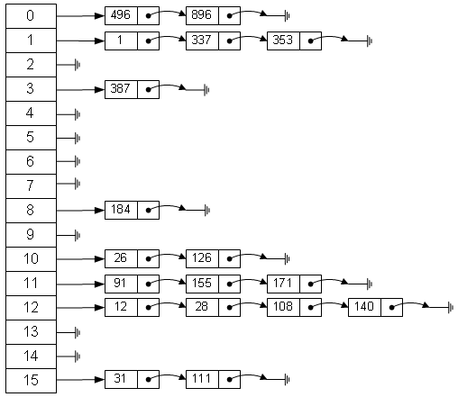

# HashMap详解

## HashMap 思想
两个最简单数据结构为数组和链表,JDK 为可扩展数组和链表分别提供了 ArrayList 和 LinkedList 两个集合 API。

ArrayList 使用扩展数组的方式实现，导致其插入元素和删除元素将导致额外开销，但因为其本质为数组，所以当拥有数组下标时能快速访问到元素对象。

而 LinkedList 与 ArrayList 恰好相反,其实现为通过双向链表，当插入和删除元素时，只需要改变节点的指向，但其访问元素时需要做头尾两端遍历获取。

当有这样一种需求，一个集合能通过某个关键字去查找元素时，不论 ArrayList 还是 LinkedList 都会需要遍历表然后逐一比对才能拿到该元素，当数据过大时，遍历开销将相当可观。

一个通俗的例子是，为了查找电话簿中某人的号码，可以创建一个按照人名首字母顺序排列的表，在首字母为W的表中查找“王”姓的电话号码，显然比直接查找就要快得多。

由于 ArrayList 和 LinkedList 均有其优缺点，所以需要一种数据结构综合两个优点，并让缺点放小，这就是散列表（哈希表）

#### 散列表

理想的散列表其实就是包含了各个元素的具有 **固定大小( length )** 的数组，查找和插入是通过这些元素的某个部分进行的，也就是 **关键字（key）** ,本质是将该关键字通过 Hash 算法散列得到 0——length-1 的下标 index ,然后将该元素插入到该 index 下标下或通过该下标访问到该元素对象。理想情况该 Hash 算法简单并能保证各个元素都能不重复的散列到 0——length-1 下标所映射的数组单元中，但这通常是做不到的，因为数组大小有限，但关键字无穷无尽，所以肯定会具有计算出相同下标的时候，这种具有重复下标的情况就叫 **Hash 冲突** 或者 **Hash 碰撞**

解决冲突的办法有多种，JDK 的 HashMap 中使用了 **分离链接法** 也叫 **拉链法**，其做法是产生冲突的元素将保留于一个单向链表中，新增加的冲突元素插入到该链表头，最终产生的结构图如下



有了以上结构，再来看插入，删除，查询一个拥有关键字的元素对象：

* 插入：

    用 key 通过 hash 算法得出插入的下标，当未产生 Hash冲突，也就是该下标中的元素为空时，则将添加一个链表头节点存入该次插入元素。当产生 Hash 冲突，也就是该下标已存在链表，则查询该链表中是否有相同 key 的元素，有则替换，否则插入到头节点（目的不仅为了方便，还经常会出现后插入元素会被更早访问的情况）。可见在未产生 Hash 冲突的时候，插入一个元素则只是对数组一个下标元素的赋值而已，在产生冲突的时候会遍历链表，但在 Hash 算法足够好时，产生冲突的链表会很短，所以遍历的元素也就很少。

    需要注意的是，由于散列表数组是个固定大小的数组，为了让冲突更少，也就是因冲突产生的链表更短，则需要使得该数组长度更大，但数组长度过大就会产生不必要的内存开销，所以要兼容两点，在 JDK HashMap 中先存在一个默认为 16 的的数组长度，当 HashMap 插入时已存在的元素个数+1超过一个最大值时，将会对该数组扩容，而后再次重新散列元素。扩容的最大值是通过一个 **装载因子**（默认为 0.75） 和当前数组长度计算得出，**扩容后为当前数组长度的两倍**。
* 查询:

    用 key 通过 hash 算法得出散列表的下标，再访问该标下的链表结构，该下标未产生冲突时，该链表只有一个链表头，也就是要访问的元素，当产生冲突时则逐一访问链表节点比对 key 值可得到要访问的元素，但产生冲突生成的链表节点很少，所以即使遍历也会开销不大。
* 删除：

    按以上查询到具体元素后去除该节点即可。


## HashMap 实现

HashMap 继承自抽象类 AbstructMap, AbstructMap 实现了 Map 接口, Map 接口具有两个泛型参数分别对象 Key 和 Value

```java
public class HashMap<K, V> extends AbstractMap<K, V> implements Cloneable, Serializable
```

```java
public abstract class AbstractMap<K, V> implements Map<K, V>
```

Map 接口中有定义一个内部接口 Entry 接口，其代表一个保存了 key 和 value 值的节点

```java
public interface Map<K,V> {
    public static interface Entry<K,V> {
        public boolean equals(Object object);
        public K getKey();
        public V getValue();
        public int hashCode();
        public V setValue(V object);
    }
}
```

在 HashMap 中具有一个静态内部类实现了 Entry 接口 为 HashMapEntry 类,其存放了单个节点元素的 key, value, hash值和链接的下一个节点元素

```java
 static class HashMapEntry<K, V> implements Entry<K, V>{
    final K key;
    V value;
    final int hash;
    HashMapEntry<K, V> next;

    HashMapEntry(K key, V value, int hash, HashMapEntry<K, V> next) {
        this.key = key;
        this.value = value;
        this.hash = hash;
        this.next = next;
    }
 }
```

HashMap 中的属性和常量

```java
public class HashMap<K, V> extends AbstractMap<K, V> implements Cloneable, Serializable {
    /**
     * 散列数组的最小个数
     */
    private static final int MINIMUM_CAPACITY = 4;
    
    /**
     * 散列数组的最大个数
     */
    private static final int MAXIMUM_CAPACITY = 1 << 30;
    
    /**
     * 默认的散列表数组
     */
    private static final Entry[] EMPTY_TABLE = new HashMapEntry[MINIMUM_CAPACITY >>> 1];

    /**
     * 默认装载因子
     */
    static final float DEFAULT_LOAD_FACTOR = .75F;
    
    /**
     * 当前散列表数组
     */
    transient HashMapEntry<K, V>[] table;
    
    /**
     * 关键字为空时所使用的节点对象
     */
    transient HashMapEntry<K, V> entryForNullKey;

    /**
     * 已存的节点个数
     */
    transient int size;

    /**
     * 散列数组修改次数
     */
    transient int modCount;

    /**
     * 数组扩容所需的极限节点个数
     */
    private transient int threshold;
}
```

HashMap 构造器

```java
    /**
     * 构造一个初始容量为 16 和 装载因子为 0.75 的 HashMap
     */
    public HashMap() {}

    /**
     * 构造一个初始容量为 capacity 和 装载因子为 0.75 的 HashMap
     */
    public HashMap(int capacity) {}

    /**
     * 构造一个初始容量为 capacity 和 装载因子为 loadFactor 的 HashMap
     */
    public HashMap(int capacity, float loadFactor) {}

    /**
     * 通过一个 Map 对象映射出一个新的 HashMap
     */
    public HashMap(Map<? extends K, ? extends V> map) {}
```

put 相关方法


```java
    public V put(K key, V value) {
        if (key == null) {
            // 当 key 为空时将该 value 保存到 entryForNullKey 节点中
            // entryForNullKey 为 HashMap 中的一个属性
            return putValueForNullKey(value);
        }

        // 通过 key 获得 hash 值
        int hash = Collections.secondaryHash(key);
        HashMapEntry<K, V>[] tab = table;

        // 通过 hash 值与当前散列表数组长度计算出下标
        int index = hash & (tab.length - 1);
        for (HashMapEntry<K, V> e = tab[index]; e != null; e = e.next) {
            // 存在冲突，则遍历查看是否有相同 key 值的元素，如果有则替换 value 值
            if (e.hash == hash && key.equals(e.key)) {
                preModify(e);
                V oldValue = e.value;
                e.value = value;
                return oldValue;
            }
        }

        modCount++;
        // 没有冲突则先查看当前已存在元素个数+1是不是已经超过了所需扩容的极限个数了
        if (size++ > threshold) {
            // 超过了扩容极限个数则扩容数组长度为原数组的两倍
            tab = doubleCapacity();
            // 由于扩容了所以需要重新散列计算出下标
            index = hash & (tab.length - 1);
        }
        // 添加一个新节点到 index 下标中
        addNewEntry(key, value, hash, index);
        return null;
    }


    private HashMapEntry<K, V>[] doubleCapacity() {
        HashMapEntry<K, V>[] oldTable = table;
        int oldCapacity = oldTable.length;
        if (oldCapacity == MAXIMUM_CAPACITY) {
            // 如果当前散列表数组大小已经等于最大值时，则不扩容
            return oldTable;
        }
        int newCapacity = oldCapacity * 2;
        // 新建一个散列表数组，数组长度为原散列表数组的两倍
        HashMapEntry<K, V>[] newTable = makeTable(newCapacity);
        if (size == 0) {
            // 如果没有存元素则直接返回该散列表数组
            return newTable;
        }

        // 如果原散列表中已存在元素则重新散列到新表中
        for (int j = 0; j < oldCapacity; j++) {
            // ... 省略代码 重新散列元素
        }
        return newTable;
    }

    private V putValueForNullKey(V value) {
        HashMapEntry<K, V> entry = entryForNullKey;
        // 判断 entryForNullKey 是否为空
        if (entry == null) {
            // 为空则新建一个节点
            addNewEntryForNullKey(value);
            size++;
            modCount++;
            return null;
        } else {
            // 不为空则替换原 value
            preModify(entry);
            V oldValue = entry.value;
            entry.value = value;
            return oldValue;
        }
    }

    void addNewEntryForNullKey(V value) {
        // 新建一个节点并赋值给 entryForNullKey 属性
        entryForNullKey = new HashMapEntry<K, V>(null, value, 0, null);
    }

    void addNewEntry(K key, V value, int hash, int index) {
        // 新建一个链表节点，并将数组该下标的链表头设置为自己的 next 节点
        // 将该节点赋值到该数组下标中
        // 也就是将一个新节点插入到散列数组 index 下标里的链表头 
        table[index] = new HashMapEntry<K, V>(key, value, hash, table[index]);
    }
```

get 相关方法

```java
    public V get(Object key) {
        if (key == null) {
            // 如果 key 为空，则直接从 entryForNullKey 属性中取值
            HashMapEntry<K, V> e = entryForNullKey;
            return e == null ? null : e.value;
        }

        // 通过 key 获得 hash 值
        int hash = Collections.secondaryHash(key);
        HashMapEntry<K, V>[] tab = table;
        // 通过 hash 值与当前散列表数组长度计算出下标
        int index = hash & (tab.length - 1);

        //通过 index 取出散列表该下标中的链表头节点,然后遍历该链表找到 key 值一致的节点，并返回节点所存的 value 值
        for (HashMapEntry<K, V> e = tab[index]; 
                e != null; e = e.next) {
            K eKey = e.key;
            if (eKey == key || (e.hash == hash && key.equals(eKey))) {
                return e.value;
            }
        }
        return null;
    }
```
