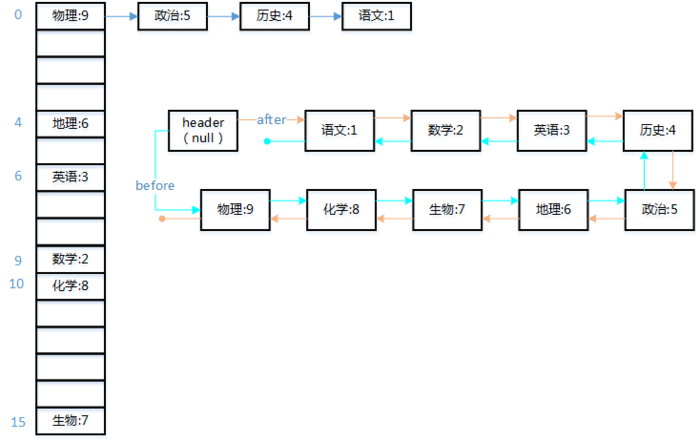

# LinkedHashMap详解

## 概述

[HashMap详解](HashMap详解.md) 已经介绍了 HashMap 的思想和实现，HashMap 让增删查的消耗得到了非常显著的优化，但是 HashMap 是散列表，也就是无序存在的，其没有提供一种有序表去做某些特定使用，所以 JAVA JDK1.4 后提供了 **LinkedHashMap** 来帮助实现有序的 HashMap。

LinkedHashMap 是 HashMap 的子类，它实际上并没有改变原有 HashMap 的数据结构，而是在每个 HashMapEntry 中加入了两个新的属性 pre 和 next，然后 LinkedHashMap 中维护了一个拥有所有元素的双向链表，该链表定义了元素的迭代顺序。

在 LinkedHashMap 中的迭代顺序规则有两种，一种为默认的按插入顺序迭代，一种当构造函数中传入 accessOrder 为 true 时使用访问数据迭代，其将会在 get 某个元素调用后将该元素移动到链表尾部，所以该顺序为访问的最早元素到最近访问的数据，但是当 get 尚未被调用时，其仍然是按默认的插入顺序迭代的。

结构图如下所示:



## LinkedHashMap 实现

LinkedHashMap 继承自 HashMap

```java
public class LinkedHashMap<K, V> extends HashMap<K, V>
```

有一个静态内部类 LinkedEntry 继承于 HashMapEntry , 所以 LinkedHashMap 中的 Entry 都是 LinkedEntry 对象

```java
    static class LinkedEntry<K, V> extends HashMapEntry<K, V> {
        LinkedEntry<K, V> nxt; // 下一个节点
        LinkedEntry<K, V> prv; // 上一个节点

        LinkedEntry() {
            super(null, null, 0, null);
            // 默认 next 和 pre 都指向自己
            nxt = prv = this;
        }

        LinkedEntry(K key, V value, int hash, HashMapEntry<K, V> next,
                    LinkedEntry<K, V> nxt, LinkedEntry<K, V> prv) {
            super(key, value, hash, next);
            this.nxt = nxt;
            this.prv = prv;
        }
    }
```

LinkedHashMap 中的属性

```java
    /**
     * 访问迭代顺序链表的头节点,可通过该节点遍历到整个链表元素
     */
    transient LinkedEntry<K, V> header;

    /**
     * 是否用访问顺序迭代，true 代表用访问顺序， false 为默认代表用插入顺序迭代
     */
    private final boolean accessOrder;

```

LinkedHashMap 构造器

```java

    /**
     * 创建一个按插入顺序迭代,默认散列表大小为 16，装载因子为 0.75 的 LinkedHashMap
     */
    public LinkedHashMap(){}

    /**
     * 创建一个按插入顺序迭代,默认散列表大小为 initialCapacity，装载因子为 0.75 的 LinkedHashMap
     */
    public LinkedHashMap(int initialCapacity) {}

    /**
     * 创建一个按插入顺序迭代,默认散列表大小为 initialCapacity，装载因子为 loadFactor 的 LinkedHashMap
     */
    public LinkedHashMap(int initialCapacity, float loadFactor) {}

    /**
     * 创建一个按 accessOrder 顺序迭代,默认散列表大小为 initialCapacity，装载因子为 loadFactor 的 LinkedHashMap
     */
    public LinkedHashMap(
            int initialCapacity, float loadFactor, boolean accessOrder) {}

    /**
     * 通过一个 Map 对象映射出一个新的 LinkedHashMap
     */
    public LinkedHashMap(Map<? extends K, ? extends V> map) {}

```

LinkedHashMap 初始化

```java
    /**
     * 初始化一个LinkedEntry 赋值给 header
     * LinkedEntry 的实例创建使用的无参构造，所以此时该 LinkedEntry 的 next 和 pre 都指向自己
     */
    void init() {
        header = new LinkedEntry<K, V>();
    }
```

LinkedHashMap 的插入相关方法

因为散列的计算规则都与 HashMap 一致，所以 LinkedHashMap 并没有重写 put 方法，而是重写了 addNewEntry addNewEntryForNullKey 方法来实现不同的 Entry 创建和添加

```java

    /**
     *插入一个节点到双向顺序链表的最后，并插入父类 HashMap 散列表的头节点
     */
    void addNewEntry(K key, V value, int hash, int index) {
        LinkedEntry<K, V> header = this.header;

        LinkedEntry<K, V> eldest = header.nxt;
        if (eldest != header && removeEldestEntry(eldest)) {
            // 此代码是如果你希望通过一定规则移除不常访问的元素或者插入的比较早的元素
            // 如果需要这么做请重写 removeEldestEntry 方法返回 true,默认该方法会返回 false 将永远不自动移除
            remove(eldest.key);
        }

        // 获取当前的双向顺序链表的最后一个节点
        LinkedEntry<K, V> oldTail = header.prv;
        // 新建一个节点，并将原双向顺序链表最后节点设置为该节点的 pre,将 header 头节点设置为该节点的 next
        LinkedEntry<K, V> newTail = new LinkedEntry<K,V>(
                key, value, hash, table[index], header, oldTail);
        // 将散列表中该 index 下标的链表头节点对象设置为新建的节点
        // 将原双向顺序链表的最后一个节点的 next 设置为新建的节点
        // 将原双向顺序链表的头节点的 pre 设置为新建的节点
        table[index] = oldTail.nxt = header.prv = newTail;
    }

    /**
     *插入一个空 key 节点到双向顺序链表的最后，并替换 HashMap 散列表 entryForNullKey 节点
     */
    void addNewEntryForNullKey(V value) {
        LinkedEntry<K, V> header = this.header;

        LinkedEntry<K, V> eldest = header.nxt;
        if (eldest != header && removeEldestEntry(eldest)) {
            remove(eldest.key);
        }

        LinkedEntry<K, V> oldTail = header.prv;
        LinkedEntry<K, V> newTail = new LinkedEntry<K,V>(
                null, value, 0, null, header, oldTail);
        entryForNullKey = oldTail.nxt = header.prv = newTail;
    }
```

LinkedHashMap 的查询相关方法 

LinkedHashMap 重写了 get 方法，但查询的具体实现和 HashMap 一致，只是多了在查找到元素后根据 accessOrder 属性调用了 makeTail 方法来做按访问顺序迭代的排序操作

```java
    public V get(Object key) {
        if (key == null) {
            HashMapEntry<K, V> e = entryForNullKey;
            if (e == null)
                return null;
            // 如果 accessOrder 为 true,则将该次访问到的 Entry 移动到双向顺序链表的尾部
            if (accessOrder)
                makeTail((LinkedEntry<K, V>) e);
            return e.value;
        }

        int hash = Collections.secondaryHash(key);
        HashMapEntry<K, V>[] tab = table;
        for (HashMapEntry<K, V> e = tab[hash & (tab.length - 1)];
                e != null; e = e.next) {
            K eKey = e.key;
            if (eKey == key || (e.hash == hash && key.equals(eKey))) {
                // 如果 accessOrder 为 true,则将该次访问到的 Entry 移动到双向顺序链表的尾部
                if (accessOrder)
                    makeTail((LinkedEntry<K, V>) e);
                return e.value;
            }
        }
        return null;
    }

    /**
     * 将一个移动到插入到双向顺序链表的尾部
     */
    private void makeTail(LinkedEntry<K, V> e) {
        e.prv.nxt = e.nxt;
        e.nxt.prv = e.prv;

        LinkedEntry<K, V> header = this.header;
        LinkedEntry<K, V> oldTail = header.prv;
        e.nxt = header;
        e.prv = oldTail;
        oldTail.nxt = header.prv = e;
        modCount++;
    }
```

LinkedHashMap 还重写了 HashMap 的 preModify 方法，LinkedHashMap 认为当原有 HashMap 中 put 时产生 Hash 冲突时所遍历链表访问到相同key 值节点时也代表了访问，而 preModify 在 HashMap 源码中可见正是在这个时候调用的，只是 HashMap 中没有对该方法做任何实现，而 LinkedHashMap 中重写了该方法去调用了 makeTail 方法

```java
    /**
     * 一次修改原有数据也代表一次访问，所以也需要进行一次访问排序
     */
    void preModify(HashMapEntry<K, V> e) {
        if (accessOrder) {
            makeTail((LinkedEntry<K, V>) e);
        }
    }
```

LinkedHashMap 的迭代器

```java
    private abstract class LinkedHashIterator<T> implements Iterator<T> {
        // 下一个节点
        LinkedEntry<K, V> next = header.nxt;
        // 最后一次迭代的节点
        LinkedEntry<K, V> lastReturned = null;
        // 当前修改数
        int expectedModCount = modCount;

        // 有没有下一个节点
        public final boolean hasNext() {
            // 当 next == header 时代表已经迭代完一圈链表
            return next != header;
        }

        final LinkedEntry<K, V> nextEntry() {
            // 如果当前修改数和该迭代器创建时的修改数不一致则抛出异常
            if (modCount != expectedModCount)
                throw new ConcurrentModificationException();
            LinkedEntry<K, V> e = next;
            if (e == header)
                throw new NoSuchElementException();
            next = e.nxt;
            return lastReturned = e;
        }

        /**
         * 迭代器提供的安全删除当前迭代的元素方法
         */
        public final void remove() {
            if (modCount != expectedModCount)
                throw new ConcurrentModificationException();
            if (lastReturned == null)
                throw new IllegalStateException();
            LinkedHashMap.this.remove(lastReturned.key);
            lastReturned = null;
            expectedModCount = modCount;
        }
    }

    private final class KeyIterator extends LinkedHashIterator<K> {
        public final K next() { return nextEntry().key; }
    }

    private final class ValueIterator extends LinkedHashIterator<V> {
        public final V next() { return nextEntry().value; }
    }

    private final class EntryIterator
            extends LinkedHashIterator<Map.Entry<K, V>> {
        public final Map.Entry<K, V> next() { return nextEntry(); }
    }

    Iterator<K> newKeyIterator() {
        return new KeyIterator();
    }
    Iterator<V> newValueIterator() {
        return new ValueIterator();
    }
    Iterator<Map.Entry<K, V>> newEntryIterator() {
        return new EntryIterator();
    }
```
