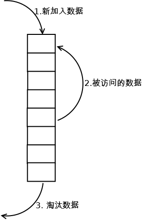

# LruCache详解(一) —— LRU算法介绍

## 淘汰算法--LRU算法

* ### LRU
    #### 原理
    LRU（Least recently used，最近最少使用）算法根据数据的历史访问记录来进行淘汰数据，其核心思想是“如果数据最近被访问过，那么将来被访问的几率也更高”。

    #### 实现
    最常见的实现是使用一个链表保存缓存数据，详细算法实现如下：

    

    * 新数据插入到链表头部
    * 每当缓存命中（即缓存数据被访问），则将数据移到链表头部；
    * 当链表满的时候，将链表尾部的数据丢弃。

    特点：是实现简单，当存在热点数据时，LRU 效率较好，但是一些偶发性的，周期性的批量操作会导致 LRU 命中率急剧下降，缓存污染情况会较严重（缓存污染为所缓存的数据为不再访问或不常访问的元素）。

    消耗代价：命中缓存需要遍历链表，找到命中的数据块索引，然后需要将数据移到头部。

* ###  LRU-K
    #### 原理
    LRU-K 中的 K 代表最近使用的次数，因此 LRU 可以认为是 LRU-1。 LRU-K 的主要目的是为了解决 LRU 算法“缓存污染”的问题，其核心思想是将“最近使用过1次”的判断标准扩展为“最近使用过K次”。

    #### 实现
    相比LRU，LRU-K需要多维护一个队列，用于记录所有缓存数据被访问的历史。只有当数据的访问次数达到K次的时候，才将数据放入缓存。当需要淘汰数据时，LRU-K会淘汰第K次访问时间距当前时间最大的数据。详细实现如下：

    

    * 数据第一次被访问，加入到访问历史列表；
    * 如果数据在访问历史列表里后没有达到 K 次访问，则按照一定规则（FIFO，LRU）淘汰；
    * 当访问历史队列中的数据访问次数达到 K 次后，将数据索引从历史队列删除，将数据移到缓存队列中，并缓存此数据，缓存队列重新按照时间排序；
    * 缓存数据队列中被再次访问后，重新排序；
    * 需要淘汰数据时，淘汰缓存队列中排在末尾的数据，即：淘汰“倒数第K次访问离现在最久”的数据。

    LRU-K具有LRU的优点，同时能够避免LRU的缺点，实际应用中LRU-2是综合各种因素后最优的选择，LRU-3或者更大的K值命中率会高，但适应性差，需要大量的数据访问才能将历史访问记录清除掉。

    特点：LRU-K 降低了“缓存污染”带来的问题，命中率比 LRU 要高。LRU-K 队列是一个优先级队列，算法复杂度和代价比较高。
    
    消耗代价：由于 LRU-K 还需要记录那些被访问过、但还没有放入缓存的对象，因此内存消耗会比 LRU 要多；当数据量很大的时候，内存消耗会比较可观。LRU-K 需要基于时间进行排序（可以需要淘汰时再排序，也可以即时排序），CPU 消耗比 LRU 要高。

* ###  Two queues（2Q）
    #### 原理
    Two queues（以下使用2Q代替）算法类似于 LRU-2，不同点在于 2Q 将 LRU-2 算法中的访问历史队列（注意这不是缓存数据的）改为一个 FIFO 缓存队列，即：2Q 算法有两个缓存队列，一个是FIFO队列，一个是LRU队列。

    #### 实现
    当数据第一次访问时，2Q 算法将数据缓存在 FIFO 队列里面，当数据第二次被访问时，则将数据从 FIFO 队列移到 LRU 队列里面，两个队列各自按照自己的方法淘汰数据。详细实现如下：

    

    * 新访问的数据插入到 FIFO 队列；
    * 如果数据在 FIFO 队列中一直没有被再次访问，则最终按照 FIFO 规则淘汰；
    * 如果数据在 FIFO 队列中被再次访问，则将数据移到 LRU 队列头部；
    * 如果数据在 LRU 队列再次被访问，则将数据移到 LRU 队列头部；
    * LRU 队列淘汰末尾的数据。

    特点：2Q 算法的命中率要高于 LRU 。需要两个队列，但两个队列本身都比较简单。
    
    消耗代价：FIFO 和 LRU 的代价之和。2Q 算法和 LRU-2 算法命中率类似，内存消耗也比较接近，但对于最后缓存的数据来说，2Q会减少一次从原始存储读取数据或者计算数据的操作。

* ###  Multi Queue（MQ）
    #### 原理
    MQ 算法根据访问频率将数据划分为多个队列，不同的队列具有不同的访问优先级，其核心思想是：优先缓存访问次数多的数据。

    #### 实现
    MQ算法将缓存划分为多个 LRU 队列，每个队列对应不同的访问优先级。访问优先级是根据访问次数计算出来的，例如
    详细的算法结构图如下，Q0，Q1....Qk代表不同的优先级队列，Q-history代表从缓存中淘汰数据，但记录了数据的索引和引用次数的队列：

    

    * 新插入的数据放入 Q0；
    * 每个队列按照 LRU 管理数据；
    * 当数据的访问次数达到一定次数，需要提升优先级时，将数据从当前队列删除，加入到高一级队列的头部；
    * 为了防止高优先级数据永远不被淘汰，当数据在指定的时间里访问没有被访问时，需要降低优先级，将数据从当前队列删除，加入到低一级的队列头部；
    * 需要淘汰数据时，从最低一级队列开始按照 LRU 淘汰；每个队列淘汰数据时，将数据从缓存中删除，将数据索引加入Q-history头部；
    * 如果数据在 Q-history 中被重新访问，则重新计算其优先级，移到目标队列的头部；
    * Q-history 按照 LRU 淘汰数据的索引。

    特点：MQ 降低了“缓存污染”带来的问题，命中率比 LRU 要高。MQ 需要维护多个队列，且需要维护每个数据的访问时间，复杂度比 LRU 高。
    
    消耗代价：MQ 需要记录每个数据的访问时间，需要定时扫描所有队列，代价比 LRU 要高。

    注：虽然 MQ 的队列看起来数量比较多，但由于所有队列之和受限于缓存容量的大小，因此这里多个队列长度之和和一个 LRU 队列是一样的，因此队列扫描性能也相近。

## LRU类算法对比

由于不同的访问模型导致命中率变化较大，此处对比仅基于理论定性分析，不做定量分析。

命中率

LRU-2 > MQ(2) > 2Q > LRU

复杂度

LRU-2 > MQ(2) > 2Q > LRU

代价

LRU-2  > MQ(2) > 2Q > LRU

实际应用中需要根据业务的需求和对数据的访问情况进行选择，并不是命中率越高越好。例如：虽然 LRU 看起来命中率会低一些，且存在”缓存污染“的问题，但由于其简单和代价小，实际应用中反而应用更多。